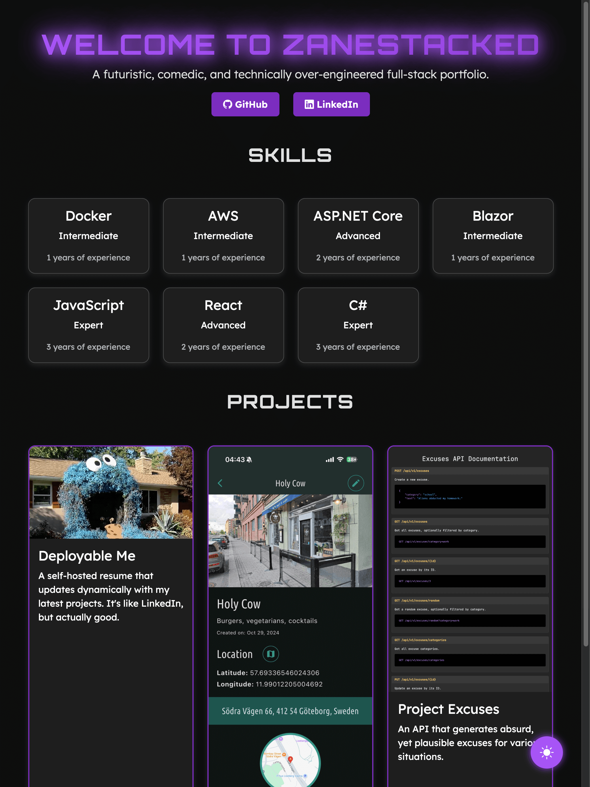
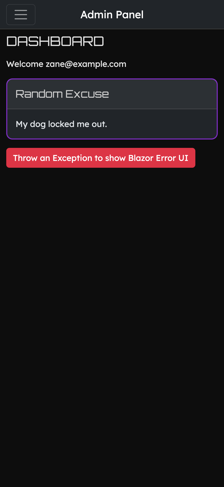
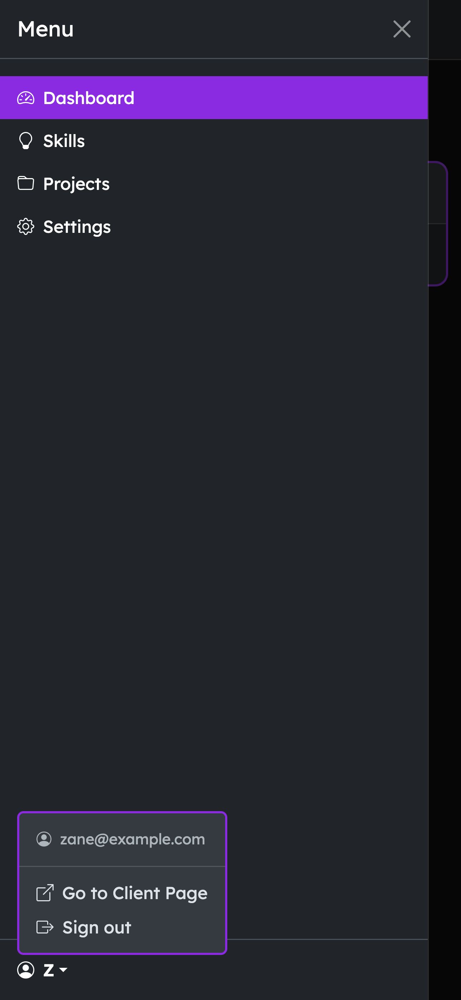
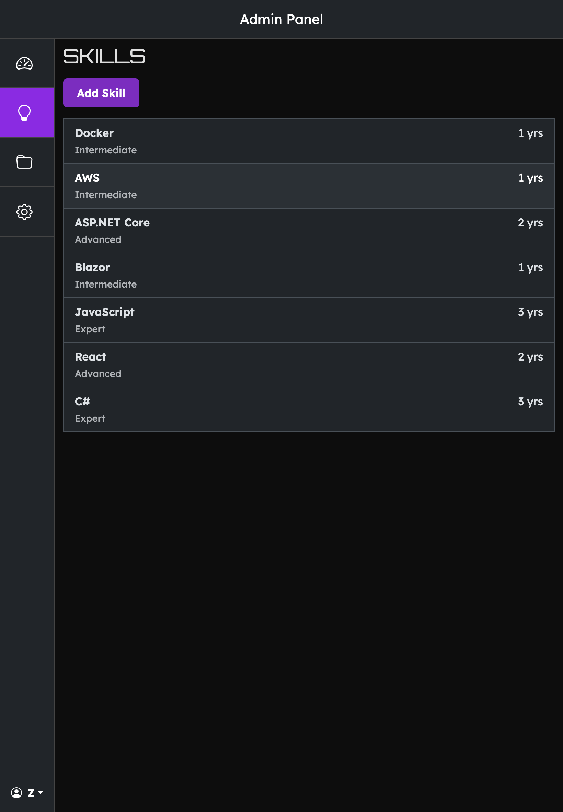
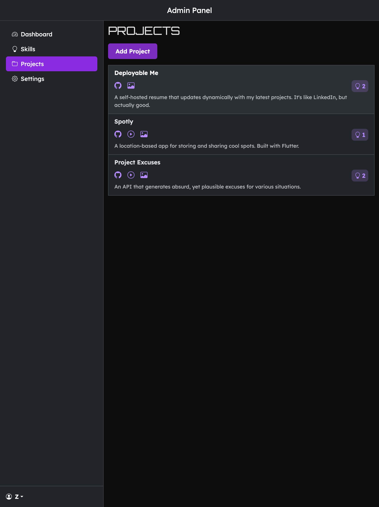
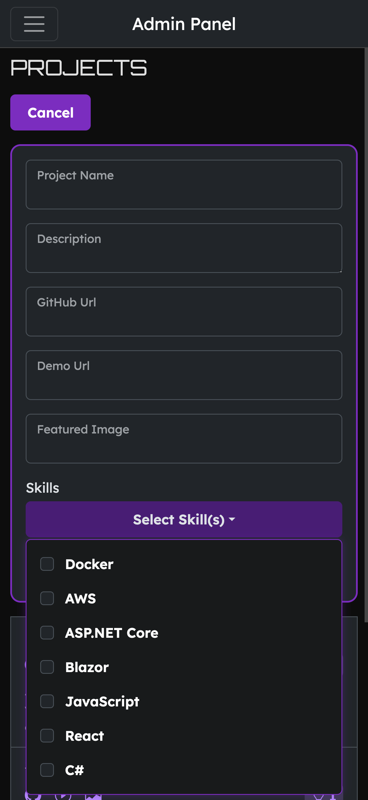
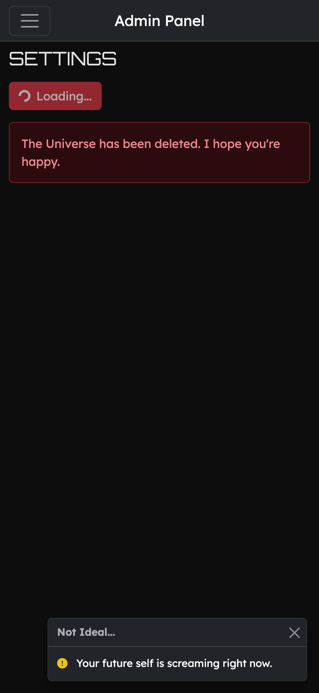
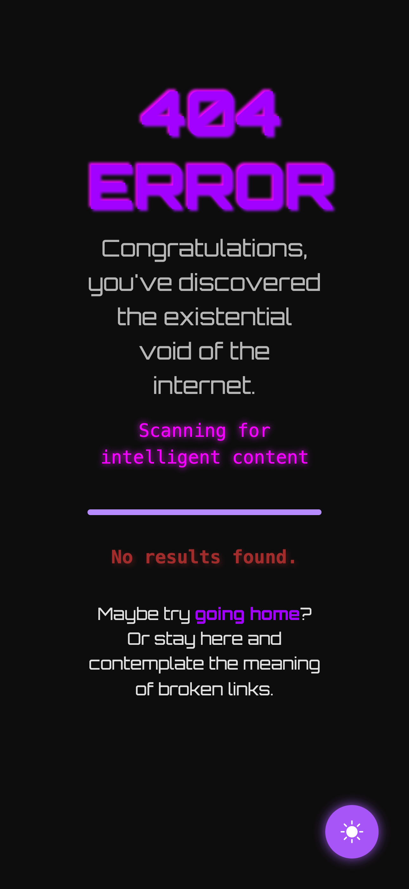

# ZaneStacked - The Only CV That Knows It's Being Watched

## Description

Welcome to **ZaneStacked**, the full-stack developer CV profile that's so futuristic, even I question if I built it or
if it built me. Built with Blazor WebAssembly and .NET Minimal API, this project showcases my skills, projects, and an
unhealthy obsession with dark humor.

> **ZaneStacked** is live → [https://neurothrone.tech](https://neurothrone.tech)

## Tech Stack

- **Blazor WebAssembly Frontend**: Because writing JavaScript is *so* 2023.
- **.NET Minimal API Backend**: Minimal but not *that* minimal.
- **Entity Framework Core**: Because manually writing SQL is for the brave.
- **Identity Authentication**: Only *real* admins allowed. No bots, no hackers, no nosey recruiters.
- **Bootstrap Styling**: Because I believe in UI *and* UX.
- **High Lighthouse Score Goal**: Trying to hit 85+ in Lighthouse. If it fails, I'll blame Google.
- **Azure Hosting**: Deployed on the cloud, where all dreams and questionable design choices live.
- **Azure SQL Server & Storage**: Because saving images locally is *so* last decade.

## Setup

### Backend Setup (ZaneStacked.Api)

Environment variables are stored in `appsettings.json` for simplicity. You *could* change them to environment variables,
but why make life harder? Just update the following:

```json
{
  "ConnectionStrings": {
    "AzureConnection": "azure-sql-server-connection-string"
  },
  "ApiUrl": "backend-base-url",
  "ClientUrl": "frontend-base-url",
  "ExcusesApiUrl": "excuses-base-api-url"
}
```

> Looking for the **Excuses API**? Check out the repo
> here: [Excuses API Repository](https://github.com/neurothrone/project-excuses)

### Frontend Setup (ZaneStacked.Web)

Same drill for the frontend: `wwwroot/appsettings.json` holds the secrets. Change as needed:

```json
{
  "ApiUrl": "backend-base-url"
}
```

## API Endpoints (For Those Who Enjoy Debugging)

| Endpoint              | Method | Description                                           |
|-----------------------|--------|-------------------------------------------------------|
| `/api/skills`         | GET    | Get all skills                                        |
| `/api/skills/{id}`    | GET    | Get a specific skill                                  |
| `/api/skills/{id}`    | PUT    | Update a skill                                        |
| `/api/skills/{id}`    | DELETE | Delete a skill                                        |
| `/api/projects`       | GET    | Get all projects                                      |
| `/api/projects/{id}`  | GET    | Get a specific project                                |
| `/api/projects/{id}`  | PUT    | Update a project                                      |
| `/api/projects/{id}`  | DELETE | Delete a project                                      |
| `/api/excuses/random` | GET    | Returns a random excuse, for when reality is too much |
| `/login`              | POST   | Logs you in (assuming you exist)                      |
| `/api/auth/logout`    | POST   | Logs you out (assuming you were ever in)              |

## License

MIT License - Do whatever you want, just don't sue me when it explodes.

## Images
















